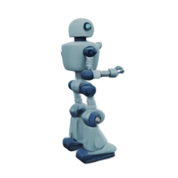
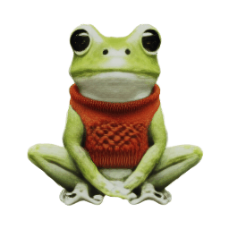
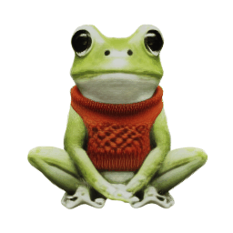
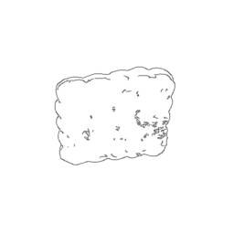

# [ICLR 2025] DiffSplat

<h4 align="center">

DiffSplat: Repurposing Image Diffusion Models for Scalable Gaussian Splat Generation

[Chenguo Lin](https://chenguolin.github.io), [Panwang Pan](https://paulpanwang.github.io), [Bangbang Yang](https://ybbbbt.com), [Zeming Li](https://www.zemingli.com), [Yadong Mu](http://www.muyadong.com)

[](https://arxiv.org/abs/2501.16764)
[](https://chenguolin.github.io/projects/DiffSplat)
[](https://huggingface.co/chenguolin/DiffSplat)
[](https://huggingface.co/spaces/paulpanwang/Diffsplat)


<p>
    
    
    
    
    
</p>
<p>
    
    
    
    
    
</p>
<p>
    
</p>

</h4>

This repository contains the official implementation of the paper: [DiffSplat: Repurposing Image Diffusion Models for Scalable Gaussian Splat Generation](https://arxiv.org/abs/2501.16764), which is accepted to ICLR 2025.
DiffSplat is a generative framework to synthesize 3D Gaussian Splats from text prompts & single-view images in 1~2 seconds. It is fine-tuned directly from a pretrained text-to-image diffusion model.

Feel free to contact me (chenguolin@stu.pku.edu.cn) or open an issue if you have any questions or suggestions.


## 📢 News

- **2025-02-02**: Inference instructions (text-conditioned & image-conditioned & controlnet) are provided.
- **2025-01-29**: The source code and pretrained models are released. Happy 🐍 Chinese New Year 🎆!
- **2025-01-22**: DiffSplat is accepted to ICLR 2025.


## 📋 TODO

- [x] Provide detailed instructions for inference.
- [ ] Provide detailed instructions for training.
- [ ] Implement a Gradio demo.


## 🔧 Installation

You may need to modify the specific version of `torch` in `settings/setup.sh` according to your CUDA version.
There are not restrictions on the `torch` version, feel free to use your preferred one.
```bash
git clone https://github.com/chenguolin/DiffSplat.git
cd DiffSplat
bash settings/setup.sh
```


## 📊 Dataset

- We use [G-Objaverse](https://github.com/modelscope/richdreamer/tree/main/dataset/gobjaverse) with about 265K 3D objects and 10.6M rendered images (265K x 40 views, including RGB, normal and depth maps) for `GSRecon` and `GSVAE` training. [Its subset](https://github.com/ashawkey/objaverse_filter) with about 83K 3D objects provided by [LGM](https://me.kiui.moe/lgm) is used for `DiffSplat` training. Their text descriptions are provided by the latest version of [Cap3D](https://huggingface.co/datasets/tiange/Cap3D) (i.e., refined by [DiffuRank](https://arxiv.org/abs/2404.07984)).
- We find the filtering is crucial for the generation quality of `DiffSplat`, and a larger dataset is beneficial for the performance of `GSRecon` and `GSVAE`.
- We store the dataset in an internal HDFS cluster in this project. Thus, the training code can NOT be directly run on your local machine. Please implement your own dataloading logic referring to our provided dataset & dataloader code.


## 🚀 Usage

### 📷 Camera Conventions

The camera and world coordinate systems in this project are both defined in the `OpenGL` convention, i.e., X: right, Y: up, Z: backward. The camera is located at `(0, 0, 1.4)` in the world coordinate system, and the camera looks at the origin `(0, 0, 0)`.
Please refer to [kiuikit camera doc](https://kit.kiui.moe/camera) for visualizations of the camera and world coordinate systems.

### 🤗 Pretrained Models

All pretrained models are available at [HuggingFace🤗](https://huggingface.co/chenguolin/DiffSplat).

| **Model Name**                | **Fine-tined From** | **#Param.** | **Link** | **Note** |
|-------------------------------|---------------------|-------------|----------|----------|
| **GSRecon**                   | From scratch                    | 42M            | [gsrecon_gobj265k_cnp_even4](https://huggingface.co/chenguolin/DiffSplat/tree/main/gsrecon_gobj265k_cnp_even4)         | Feed-forward reconstruct per-pixel 3DGS from 4-view (RGB, normal, coordinate) maps         |
| **GSVAE (SD)**                | [SD1.5 VAE](https://huggingface.co/stable-diffusion-v1-5/stable-diffusion-v1-5)                    | 84M            | [gsvae_gobj265k_sd](https://huggingface.co/chenguolin/DiffSplat/tree/main/gsvae_gobj265k_sd)         |          |
| **GSVAE (SDXL)**              | [SDXL fp16 VAE](https://huggingface.co/madebyollin/sdxl-vae-fp16-fix)                    | 84M            | [gsvae_gobj265k_sdxl_fp16](https://huggingface.co/chenguolin/DiffSplat/tree/main/gsvae_gobj265k_sdxl_fp16)         | fp16-fixed SDXL VAE is more robust         |
| **GSVAE (SD3)**               | [SD3 VAE](https://huggingface.co/stabilityai/stable-diffusion-3-medium)                    | 84M            | [gsvae_gobj265k_sd3](https://huggingface.co/chenguolin/DiffSplat/tree/main/gsvae_gobj265k_sd3)         |          |
| **DiffSplat (SD1.5)**            | [SD1.5](https://huggingface.co/stable-diffusion-v1-5/stable-diffusion-v1-5)                    | 0.86B            | Text-cond: [gsdiff_gobj83k_sd15__render](https://huggingface.co/chenguolin/DiffSplat/tree/main/gsdiff_gobj83k_sd15__render)<br> Image-cond: [gsdiff_gobj83k_sd15_image__render](https://huggingface.co/chenguolin/DiffSplat/tree/main/gsdiff_gobj83k_sd15_image__render)         | Best efficiency         |
| **DiffSplat (PixArt-Sigma)** | [PixArt-Sigma](https://huggingface.co/PixArt-alpha/PixArt-Sigma-XL-2-512-MS)                    | 0.61B            | Text-cond: [gsdiff_gobj83k_pas_fp16__render](https://huggingface.co/chenguolin/DiffSplat/tree/main/gsdiff_gobj83k_pas_fp16__render)<br> Image-cond: [gsdiff_gobj83k_pas_fp16_image__render](https://huggingface.co/chenguolin/DiffSplat/tree/main/gsdiff_gobj83k_pas_fp16_image__render)         | Best Trade-off         |
| **DiffSplat (SD3.5m)**         | [SD3.5 median](https://huggingface.co/stabilityai/stable-diffusion-3.5-medium)                    | 2.24B            | Text-cond: [gsdiff_gobj83k_sd35m__render](https://huggingface.co/chenguolin/DiffSplat/tree/main/gsdiff_gobj83k_sd35m__render)<br> Image-cond: [gsdiff_gobj83k_sd35m_image__render](https://huggingface.co/chenguolin/DiffSplat/tree/main/gsdiff_gobj83k_sd35m_image__render)         | Best performance        |
| **DiffSplat ControlNet (SD1.5)**         | From scratch                    | 361M            | Depth: [gsdiff_gobj83k_sd15__render__depth](https://huggingface.co/chenguolin/DiffSplat/tree/main/gsdiff_gobj83k_sd15__render__depth)<br> Normal: [gsdiff_gobj83k_sd15__render__normal](https://huggingface.co/chenguolin/DiffSplat/tree/main/gsdiff_gobj83k_sd15__render__normal)<br> Canny: [gsdiff_gobj83k_sd15__render__canny](https://huggingface.co/chenguolin/DiffSplat/tree/main/gsdiff_gobj83k_sd15__render__canny)         |          |
| **(Optional) ElevEst**                   | [dinov2_vitb14_reg](https://github.com/facebookresearch/dinov2)                    | 86 M            | [elevest_gobj265k_b_C25](https://huggingface.co/chenguolin/DiffSplat/tree/main/elevest_gobj265k_b_C25)         | (Optional) Single-view image elevation estimation        |


### ⚡ Inference

#### 0. Download Pretrained Models

Note that:
- Pretrained weights will download from HuggingFace and stored in `./out`.
- Other pretrained models (such as CLIP, T5, image VAE, etc.) will be downloaded automatically and stored in your HuggingFace cache directory.
- If you face problems in visiting HuggingFace Hub, you can try to set the environment variable `export HF_ENDPOINT=https://hf-mirror.com`.

```bash
python3 download_ckpt.py --model_type [MODEL_TYPE] [--image_cond]

# `MODEL_TYPE`: choose from "sd15", "pas", "sd35m", "depth", "normal", "canny", "elevest"
# `--image_cond`: add this flag for downloading image-conditioned models
```

For example, to download the `text-cond SD1.5-based DiffSplat`:
```bash
python3 download_ckpt.py --model_type sd15
```
To download the `image-cond PixArt-Sigma-based DiffSplat`:
```bash
python3 download_ckpt.py --model_type pas --image_cond
```

#### 1. Text-conditioned 3D Object Generation

Note that:
- Model differences may not be significant for simple text prompts. We recommend using `DiffSplat (SD1.5)` for better efficiency, `DiffSplat (SD3.5m)` for better performance, and `DiffSplat (PixArt-Sigma)` for a better trade-off.
- By default, `export HF_HOME=~/.cache/huggingface`, `export TORCH_HOME=~/.cache/torch`. You can change these paths in `scripts/infer.sh`. SD3-related models require HuggingFace token for downloading, which is expected to be stored in `HF_HOME`.
- Outputs will be stored in `./out/<MODEL_NAME>/inference`.
- Prompt is specified by `--prompt` (e.g., `a_toy_robot`). Please seperate words by `_` and it will be replaced by space in the code automatically.
- If `"gif"` is in `--output_video_type`, the output will be a `.gif` file. Otherwise, it will be a `.mp4` file. If `"fancy"` is in `--output_video_type`, the output video will be in a fancy style that 3DGS scales gradually increase while rotating.
- `--seed` is used for random seed setting. `--gpu_id` is used for specifying the GPU device.
- Use `--half_precision` for `BF16` half-precision inference. It will reduce the memory usage but may slightly affect the quality.

```bash
# DiffSplat (SD1.5)
bash scripts/infer.sh src/infer_gsdiff_sd.py configs/gsdiff_sd15.yaml gsdiff_gobj83k_sd15__render \
--prompt a_toy_robot --output_video_type gif \
--gpu_id 0 --seed 0 [--half_precision]

# DiffSplat (PixArt-Sigma)
bash scripts/infer.sh src/infer_gsdiff_pas.py configs/gsdiff_pas.yaml gsdiff_gobj83k_pas_fp16__render \
--prompt a_toy_robot --output_video_type gif \
--gpu_id 0 --seed 0 [--half_precision]

# DiffSplat (SD3.5m)
bash scripts/infer.sh src/infer_gsdiff_sd3.py configs/gsdiff_sd35m_80g.yaml gsdiff_gobj83k_sd35m__render \
--prompt a_toy_robot --output_video_type gif \
--gpu_id 0 --seed 0 [--half_precision]
```

You will get:
| DiffSplat (SD1.5) | DiffSplat (PixArt-Sigma) | DiffSplat (SD3.5m) |
|-------------------------|-------------------------------|-------------------------|
|  |  |  |


**More Advanced Arguments**:
- `--prompt_file`: instead of using `--prompt`, `--prompt_file` will read prompts from a `.txt` file line by line.
- Diffusion configurations:
    - `--scheduler_type`: choose from `ddim`, `dpmsolver++`, `sde-dpmsolver++`, etc.
    - `--num_inference_timesteps`: the number of diffusion steps.
    - `--guidance_scale`: classifier-free guidance (CFG) scale; `1.0` means no CFG.
    - `--eta`: specified for `DDIM` scheduler; the weight of noise for added noise in diffusion steps.
- [Instant3D](https://instant-3d.github.io) tricks:
    - `--init_std`, `--init_noise_strength`, `--init_bg`: initial noise settings, cf. [Instant3D Sec. 3.1](https://arxiv.org/pdf/2311.06214); NOT used by default, as we found it's not that helpful in our case.
- Others:
    - `--elevation`: elevation for viewing and rendering; not necessary for text-conditioned generation; set to `10` by default (from xz-plane (`0`) to +y axis (`90`)).
    - `--negative_prompt`: empty prompt (`""`) by default; used with CFG for better visual quality (e.g., more vibrant colors), but we found it causes lower metric values (such as [ImageReward](https://github.com/THUDM/ImageReward)).
    - `--save_ply`: save the generated 3DGS as a `.ply` file; used with `--opacity_threshold_ply` to filter out low-opacity splats for a much smaller `.ply` file size.
    - `--eval_text_cond`: evaluate text-conditioned generation automatically.
    - ...

Please refer to [infer_gsdiff_sd.py](./src/infer_gsdiff_sd.py), [infer_gsdiff_pas.py](./src/infer_gsdiff_pas.py), and [infer_gsdiff_sd3.py](./src/infer_gsdiff_sd3.py) for more argument details.

#### 2. Image-conditioned 3D Object Generation

Note that:
- Most of the arguments are the same as text-conditioned generation. Our method support **text and image as conditions simultaneously**.
- Elevation is necessary for image-conditioned generation. You can specify the elevation angle by `--elevation` for viewing and rendering (from xz-plane (`0`) to +y axis (`90`)) or estimate it from the input image by `--use_elevest` (download the pretrained `ElevEst` model by `python3 download_ckpt.py --model_type elevest`) first. But we found that the **estimated elevation is not always accurate**, so it's better to set it manually.
- Text prompt is **optional** for image-conditioned generation. If you want to use text prompt, you can specify it by `--prompt` (e.g., `a_frog`), otherwise, empty prompt (`""`) will be used. Note that **DiffSplat (SD3.5m)** is sensitive to text prompts, and it may generate bad results without a proper prompt.
- Remember to set a smaller `--guidance_scale` for image-conditioned generation, as the default value is set for text-conditioned generation. `2.0` is recommended for most cases.
- `--triangle_cfg_scaling` is a trick that set larger CFG values for far-away views from the input image, while smaller CFG values for close-up views, cf. [SV3D Sec. 3](https://arxiv.org/pdf/2403.12008).
- `--rembg_and_center` will remove the background and center the object in the image. It can be used with `--rembg_model_name` (by default `u2net`) and `--border_ratio` (by default `0.2`).
- Image-conditioned generation is more sensitive to arguments, and you may need to tune them for better results.

```bash
# DiffSplat (SD1.5)
bash scripts/infer.sh src/infer_gsdiff_sd.py configs/gsdiff_sd15.yaml gsdiff_gobj83k_sd15_image__render \
--rembg_and_center --triangle_cfg_scaling --output_video_type gif --guidance_scale 2 \
--image_path assets/grm/frog.png --elevation 20 --prompt a_frog

# DiffSplat (PixArt-Sigma)
bash scripts/infer.sh src/infer_gsdiff_pas.py configs/gsdiff_pas.yaml gsdiff_gobj83k_pas_fp16_image__render \
--rembg_and_center --triangle_cfg_scaling --output_video_type gif --guidance_scale 2 \
--image_path assets/grm/frog.png --elevation 20 --prompt a_frog

# DiffSplat (SD3.5m)
bash scripts/infer.sh src/infer_gsdiff_sd3.py configs/gsdiff_sd35m_80g.yaml gsdiff_gobj83k_sd35m_image__render \
--rembg_and_center --triangle_cfg_scaling --output_video_type gif --guidance_scale 2 \
--image_path assets/grm/frog.png --elevation 20 --prompt a_frog
```

You will get
| Arguments | DiffSplat (SD1.5) | DiffSplat (PixArt-Sigma) | DiffSplat (SD3.5m) |
|---------|-------------------------|-------------------------------|-------------------------|
| `--elevation 20 --prompt a_frog` |  |  |  |
| `--use_elevest --prompt a_frog` (estimated elevation: -0.78 deg) |  |  |  |
| `--elevation 20` (prompt is `""`) |  |  |  |

**More Advanced Arguments**:
- `--image_dir`: instead of using `--image_path`, `--image_dir` will read images from a directory.

Please refer to [infer_gsdiff_sd.py](./src/infer_gsdiff_sd.py), [infer_gsdiff_pas.py](./src/infer_gsdiff_pas.py), and [infer_gsdiff_sd3.py](./src/infer_gsdiff_sd3.py) for more argument details.

#### 3. ControlNet for 3D Object Generation

Note that:
- After downloading pretrained **DiffSplat (SD1.5)**, you shoule download the controlnet weights by `python3 download_ckpt.py --model_type [depth | normal | canny]`.
- For **depth-controlnet**, values in depth maps are normalized to `[0, 1]` and larger values (white) mean closer to the camera (smaller depth). Please refer to [GObjaverse Dataset](./src/data/gobjaverse_parquet_dataset.py) for more details.
- For **normal-controlnet**, input camera is normalized to locate at `(0, 0, 1.4)` and look at `(0, 0, 0)`, thus the input normal maps are transformed accordingly. Please refer to [GObjaverse Dataset](./src/data/gobjaverse_parquet_dataset.py) for more details.
- For **canny-controlnet**, canny edges are extracted from the input RGB images automatically by `cv2.Canny`. Please refer to [GObjaverse Dataset](./src/data/gobjaverse_parquet_dataset.py) for more details.

```bash
# ControlNet (depth)
bash scripts/infer.sh src/infer_gsdiff_sd.py configs/gsdiff_sd15.yaml gsdiff_gobj83k_sd15__render \
--load_pretrained_controlnet gsdiff_gobj83k_sd15__render__depth \
--output_video_type gif --image_path assets/diffsplat/controlnet/toy_depth.png \
--prompt teddy_bear --elevation 10

# ControlNet (normal)
bash scripts/infer.sh src/infer_gsdiff_sd.py configs/gsdiff_sd15.yaml gsdiff_gobj83k_sd15__render \
--load_pretrained_controlnet gsdiff_gobj83k_sd15__render__normal \
--output_video_type gif --image_path assets/diffsplat/controlnet/robot_normal.png \
--prompt iron_robot --elevation 10

# ControlNet (canny)
bash scripts/infer.sh src/infer_gsdiff_sd.py configs/gsdiff_sd15.yaml gsdiff_gobj83k_sd15__render \
--load_pretrained_controlnet gsdiff_gobj83k_sd15__render__canny \
--output_video_type gif --image_path assets/diffsplat/controlnet/cookie_canny.png \
--prompt book --elevation 10
```

You will get:
| Original Image | Input Control | `--prompt teddy_bear` | `--prompt panda` |
|----------------|---------------|-----------------------|--------------------|
|  |  |  |  |

| Original Image | Input Control | `--prompt iron_robot` | `--prompt plush_dog_toy` |
|----------------|---------------|-----------------------|--------------------|
|  |  |  |  |

| Original Image | Input Control | `--prompt book` | `--prompt cookie` |
|----------------|---------------|-----------------|---------------------|
|  |  |  |  |

**More Advanced Arguments**:
- `--guess_mode`: ControlNet encoder tries to recognize the content of the input image even if you remove all prompts, cf. [the original ControlNet repo](https://github.com/lllyasviel/ControlNet#guess-mode--non-prompt-mode) and [HF ControlNet](https://huggingface.co/docs/diffusers/using-diffusers/controlnet#guess-mode).
- `--controlnet_scale`: determines how much weight to assign to the conditioning inputs; outputs of the ControlNet are multiplied by `controlnet_scale` before they are added to the residual in the original UNet.

Please refer to [infer_gsdiff_sd.py](./src/infer_gsdiff_sd.py) for more argument details.


### 🦾 Training

#### 1. GSRecon

Please refer to [train_gsrecon.py](./src/train_gsrecon.py).

Instructions for `GSRecon` training will be provided soon.

#### 2. GSVAE

Please refer to [train_gsvae.py](./src/train_gsvae.py).

Instructions for `GSVAE` training will be provided soon.

#### 3. DiffSplat

Please refer to [train_gsdiff_sd.py](./src/train_gsdiff_sd.py), [train_gsdiff_pas.py](./src/train_gsdiff_pas.py), and [train_gsdiff_sd3.py](./src/train_gsdiff_sd3.py).

Instructions for `DiffSplat` training will be provided soon.

#### 4. ControlNet

Please refer to [train_gsdiff_sd_controlnet.py](./src/train_gsdiff_sd_controlnet.py).

Instructions for `ControlNet` training and inference will be provided soon.


## 😊 Acknowledgement
We would like to thank the authors of [LGM](https://me.kiui.moe/lgm), [GRM](https://justimyhxu.github.io/projects/grm), and [Wonder3D](https://www.xxlong.site/Wonder3D) for their great work and generously providing source codes, which inspired our work and helped us a lot in the implementation.


## 📚 Citation
If you find our work helpful, please consider citing:
```bibtex
@inproceedings{lin2025diffsplat,
  title={DiffSplat: Repurposing Image Diffusion Models for Scalable 3D Gaussian Splat Generation},
  author={Lin, Chenguo and Pan, Panwang and Yang, Bangbang and Li, Zeming and Mu, Yadong},
  booktitle={International Conference on Learning Representations (ICLR)},
  year={2025}
}
```
